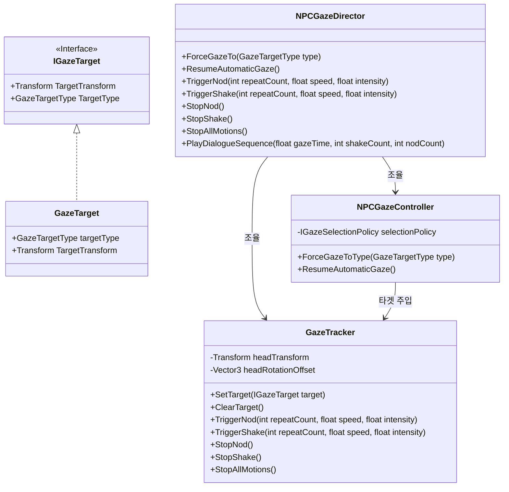

# 📖 Gaze System 개발자 설명서 (Gaze System Manual)

본 문서는 **Gaze System** 라이브러리를 다른 유니티 프로젝트에 이식하고, 상황에 따라 직접 NPC의 시선과 고개 짓(Nod/Shake) 리액션을 호출하여 제어하는 방법을 안내합니다.

---

## 📐 1. 시스템 구조 (Architecture)

각 컴포넌트들은 **인터페이스 기반의 약결합(Decoupled)** 구조로 설계되어 있어, 역할별로 철저히 독립되어 작동합니다.



---

## 🚚 2. 타 프로젝트 이식 방법 (Porting Guide)

1. **폴더 복사**: 현재 프로젝트의 `Assets/GazeSystem/` 폴더를 다른 유니티 프로젝트의 `Assets/` 아래로 복사해 넣습니다.
2. **종속성**: 추가 외부 에셋이나 플러그인이 필요 없으며, 유니티 구형 Input Manager 및 신형 Input System 모두와 호환되므로 즉시 컴파일됩니다.

---

## 💻 3. 개발자 API 설명서 (Developer API Reference)

개발자는 NPC에 부착된 최상위 컴포넌트인 **`NPCGazeDirector`** 하나만을 참조하여 모든 시선과 리액션을 애니메이션 트리거처럼 간편하게 제어할 수 있습니다.

### 1) 고개 끄덕끄덕 리액션 (`TriggerNod`)
NPC가 플레이어의 질문에 긍정하거나 동의할 때 호출합니다. 횟수를 지정하거나 무한히 반복하도록 설정할 수 있습니다.

```csharp
using UnityEngine;
using GazeSystem;

public class DialogueEventListener : MonoBehaviour
{
    [SerializeField] private NPCGazeDirector npcDirector; // 제어할 NPC의 디렉터 지정

    // 예시 1: 플레이어에게 가볍게 1번 끄덕여 긍정 (기본값 = 1회)
    public void OnPlayerGreeting()
    {
        npcDirector.TriggerNod(); 
    }

    // 예시 2: 크게 3번 동의의 끄덕임 실행
    public void OnDeepAgreement()
    {
        // 3회 반복, 속도 10f, intensity(흔들림 각도) 14도
        npcDirector.TriggerNod(repeatCount: 3, speed: 10f, intensity: 14f); 
    }

    // 예시 3: 상황이 끝날 때까지 영구적으로 계속 고개를 끄덕거리게 설정 (무한 루프)
    public void OnListeningStart()
    {
        // repeatCount가 -1 이면 수동 중지할 때까지 계속 무한 반복합니다.
        npcDirector.TriggerNod(repeatCount: -1); 
    }

    // 예시 4: 무한 루프 모션 중단
    public void OnListeningEnd()
    {
        npcDirector.StopNod(); // 즉시 끄덕임 정지
    }
}
```

### 2) 고개 절레절레 리액션 (`TriggerShake`)
NPC가 질문에 부정하거나 거절할 때 호출합니다. 마찬가지로 횟수 지정 및 무한 루프를 지원합니다.

```csharp
// 예시 5: 퀘스트 거절의 뜻으로 2번 빠르게 고개를 저음
public void OnQuestRejected()
{
    // 2회 반복, 속도 12f(빠름), intensity 11도
    npcDirector.TriggerShake(repeatCount: 2, speed: 12f, intensity: 11f);
}

// 예시 6: 계속 불만이나 고민의 뜻으로 고개를 계속 절레절레 저음 (무한 루프)
public void OnNPCConcern()
{
    npcDirector.TriggerShake(repeatCount: -1);
}

// 예시 7: 흔들림 모션 강제 즉시 정지
public void OnNPCSettle()
{
    npcDirector.StopShake(); // 즉시 절레절레 정지
    // 또는 npcDirector.StopAllMotions(); 를 사용하여 모든 모션을 한번에 멈출 수 있습니다.
}
```

### 3) 시선 강제 고정 및 자동 복귀 (Gaze Override)
대화 중 플레이어의 얼굴을 똑바로 보게 하거나, 특정 앵커를 쳐다보게 강제할 수 있습니다.

```csharp
// NPC가 내 얼굴을 똑바로 주시하도록 강제 고정
npcDirector.ForceGazeTo(GazeTargetType.Face);

// NPC가 내 왼손을 쳐다보도록 강제 고정
npcDirector.ForceGazeTo(GazeTargetType.LeftHand);

// 강제 고정을 해제하고, 다시 원래의 자동 시선 분산(얼굴 -> 손 -> 얼굴)으로 복구
npcDirector.ResumeAutomaticGaze();
```

---

## 🛠️ 4. 씬 컴포넌트 셋업 요약

### 👤 플레이어 오브젝트
- **`PlayerGazeTargetAutoSetup`** 부착
- `Head Anchor` 슬롯에 카메라를 할당합니다. (PC 모드일 때 바닥 Y=0.5 높이에 가상 손을 자동 스폰 및 강제 고정시킵니다.)

### 🤖 NPC 오브젝트
- 아래 **4개** 컴포넌트를 모두 부착합니다:
  1. **`GazeTracker`** : 머리 뼈(`mixamorig:Head`)를 슬롯에 할당하고, 정면 오프셋 각도(예: X에 `90` 또는 `-90`)를 정렬합니다.
  2. **`SequenceGazeSelectionPolicy`** : 순서형 시선 교체 정책
  3. **`NPCGazeController`** : 시선 자동 제어
  4. **`NPCGazeDirector`** : 최상위 통제 API (본 매뉴얼 사용 대상)
